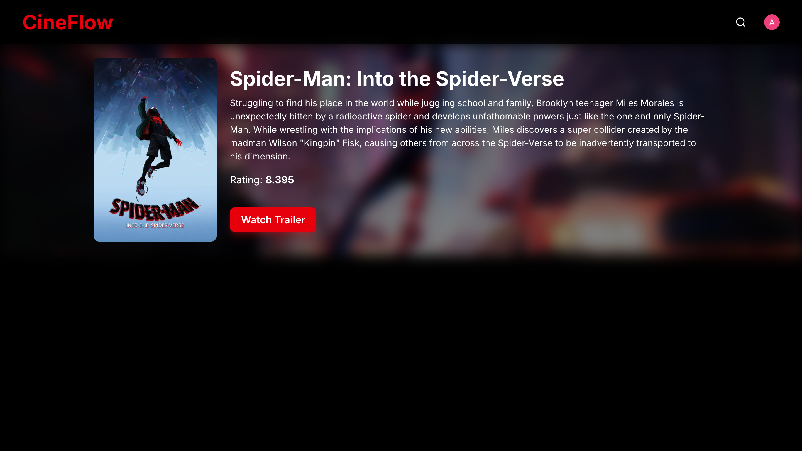

# Movie Stream App - CineFlow

This project is a **React-based streaming platform** developed as a learning project, inspired by modern streaming services.  
It allows users to **browse movies** through a dynamic and responsive interface.

## 🖼️ Screenshots / Demo

## 🌐 Live Demo

Check out my live Movie Stream App:
[](https://cineflow-movie-stream-app.vercel.app/)

### Home Screen

[](https://cineflow-movie-stream-app.vercel.app/)

### Search Screen


## Movie Screen



---

## 🎯 Project Objectives

The main goals of this project are to:

- Fetch and display movie data from **TMDB API**
- Implement **dynamic search** for movie results
- Demonstrate integration of authentication and state management
- Practice working with **modern React tools**
- Build a clean, responsive, and modern user interface suitable for a portfolio

---

## 🛠️ Technologies & Libraries Used

- **React** – Main frontend framework
- **Shadcn/UI** – Component library for UI elements
- **Lucide Icons** – For modern, customizable icons
- **Zustand** – State management
- **TanStack Router** – For Routing
- **TanStack Query** – Data fetching and caching
- **Clerk** – Authentication and user management

---

## 💡 Features

- HomePage: Browse popular movies
- Search: Dynamic debounced search for movies
- Pagination: Modern pagination with ellipsis and first/last arrows
- Authentication: Sign up / Log in with Clerk
- Responsive and modern UI
- API Caching & Fetching: Using TanStack Query

## 🔑 Getting a TMDB API Key

To use this project, you need your own API key from TMDB:

1. Go to the [TMDB API portal](https://www.themoviedb.org/documentation/api).
2. Sign up or log in and request an API key.

## 🚀 Getting Started

Follow these steps to run the project locally:

### Installation

1. Clone the repository:

```bash
git clone https://github.com/andref218/movieStreamApp.git
cd movieStreamApp
```

2. Install dependencies:

```bash
npm install
```

3. Setup environment variables:
   Create a `.env` file at the project root:

```env
VITE_TMDB_AUTH_TOKEN=your_tmdb_bearer_token_here
VITE_CLERK_PUBLISHABLE_KEY=your_clerk_key_here
```

4. Clerk Setup (Important)

For Developers:

- To run the app locally and test authentication, you need a Clerk developer account to get a Frontend API key.
- Sign up at Clerk and create a new application. Copy the Frontend API key to your .env.

5. Run the development server:

```bash
npm run dev
```

## 📂 Project Structure

```text
movieStreamApp/
├── src/
│   ├── components/       # React components
│   │   ├── Header.tsx
│   │   ├── Hero.tsx
│   │   ├── MovieCard.tsx
│   │   ├── MovieList.tsx
│   │   ├── Movies.tsx
│   │   ├── NotFoundPage.tsx
│   │   ├── Pagination.tsx
│   │   └── SearchBar.tsx
│   ├── hooks/            # Custom React hooks
│   │   └── useMovies.ts
│   ├── store/            # Zustand store
│   │   └── searchStore.ts
│   ├── routes/           # TanStack Router routes
│   │   ├── movie/
│   │       └── $movieId.tsx
│   │   ├── __root.tsx
│   │   ├── index.tsx
│   │   ├── router.ts
│   │   └── search.tsx
│   ├── data/             # Mock data
│   └── types.ts          # Types
├── public/               # Static assets
├── .env                  # Environment variables
├── vite.config.ts         # Vite configuration
├── vitest.config.ts       # Vitest configuration
└── tailwind.config.js     # Tailwind CSS configuration
```
